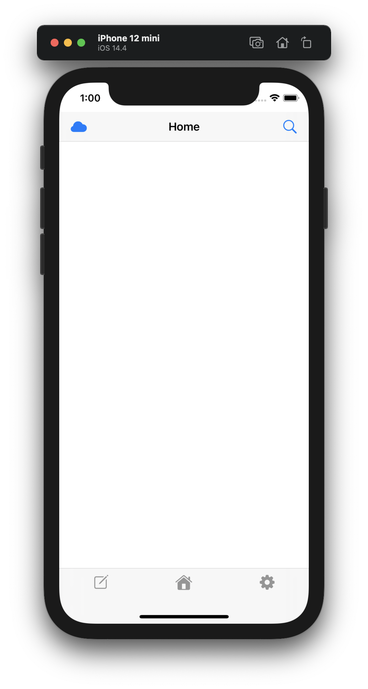

# ToDoAppEx
## 画面イメージ
 
 
## 各画面  

- ホーム画面  
- 編集画面  
- 設定画面  
- 共有画面  
- 検索画面  

## ホーム画面  

ToDoをチェックする画面  

## 編集画面  

ToDoの作成、編集、削除を行う画面  

## 設定画面  

アカウント設定、色の設定、カテゴリの設定などを行う画面  

## 共有画面  

自分のデータを皆に共有したり、皆の共有データを見たりする画面  

## 検索画面  

過去のToDoデータを単語やカテゴリで検索する画面  

